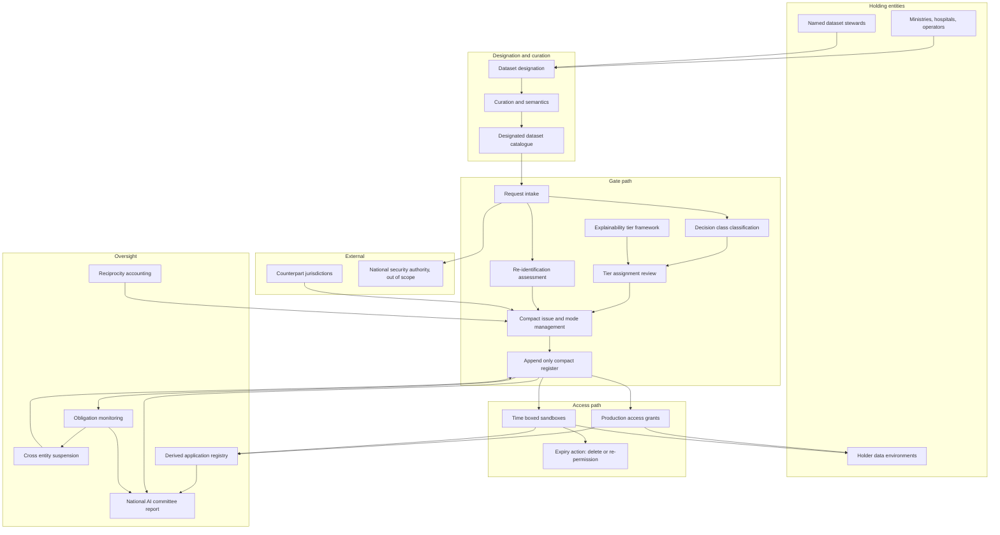

# Mithaq

**Source:** `ai-in-gov/National_AI_Strategy_for_Qatar-Blueprint_30Jan2019/`
**Domain:** `ai-gov`
**One-liner:** A national data-sharing compact register that turns Qatar's data-access pillar into enforceable, reciprocal licences — binding on government entities, obliging the receiver rather than only permitting the holder, and gating each release on an assigned explainability tier and a time-boxed sandbox.
**Wedge:** The custodians of Qatar's few genuinely high-value national datasets — Qatar Genome Project cohorts and the clinical estate around Hamad Medical Corporation, SIDRA and Weill-Cornell; the Arabic-language corpora behind Farasa and QCRI's speech and translation systems; and the transport, port and event telemetry generated by the Hamad Port and Airport, Qatar Rail and the FIFA World Cup 2022 build-out.
**Positioning:** National data-access and sandbox governance. Open-data portals publish what is safe to give away; Mithaq governs what is too valuable to give away casually — a reciprocity-priced, obligation-bearing compact with an explainability tier bound to the class of decision the data will eventually inform, and a register designed so that a cross-border arrangement is an instrument the state can offer rather than a treaty it drafts from scratch.

## Market research synthesis

### Thesis from source

The blueprint is authored by the Qatar Center for Artificial Intelligence, established under the Qatar Computing Research Institute, and dated 30 January 2019. Its ambition is stated as making AI "so pervasive in all aspects of life, business and governance in Qatar that everyone looks up to Qatar as a role model for AI+X nation", organised into six pillars — education, data access, employment, business, research, and ethics — and expressly positioned as a technological enabler for the four pillars of Qatar National Vision 2030. Its closing governance recommendation is a single sentence with large consequences: "the government of Qatar should appoint a senior level AI committee similar to NCIS under the Prime Minister's office." Everything in the document that requires cross-ministry authority hangs from that unbuilt institution.

Pillar 2 is where the document is most precise about a mechanism, and it is unusually candid about why sharing fails. It names exactly two impediments: data "has strategic and monetary value to the organization — there is a saying that 'data is the new oil'", and "data sharing can violate the privacy of users". Its conclusion is the operative insight — "People with data are (justifiably) worried about these two considerations when they share data, so the tendency is not to share." The recommendations that follow are not about portals. They ask Qatar to "develop guidelines for data sharing that encourage people with data to share it", and specifically that "the guidelines should spell out the obligations of the receiver of the data", with the crucial escalation clause: "For government entities, these guidelines can be elevated to be mandatory policies." A third recommendation asks Qatar to leverage locally collected data "by integrating and curating in ways that allow it to be repurposed and hence democratizes development of novel futuristic applications". A compact that binds the receiver, that can be compulsory for state bodies and voluntary for private ones, and that is written so a second application can reuse the same asset: that is a product specification, not a policy platitude.

The document then adds an international ambition that only makes sense if the domestic instrument exists first. It asks Qatar to "launch and lead multilateral level diplomatic efforts for data-sharing among countries", reasoning that "for most countries including Qatar, developing successful AI applications that can generate export revenue won't be possible without greater data sharing at a global level", and notes the gap plainly: "There is no such multilateral initiative in the world, hence this is an opportunity for Qatar to take a leadership role." The blueprint also names the country's structural advantage for exactly this work — Qatar is "a small country that is well connected administratively", which "makes development of broad data sharing guidelines possible, and it can be one of the competitive advantages of Qatar in the area of AI." A country of roughly 2.5 million people, of whom about 10% are Qatari nationals, with over 94% internet usage, can plausibly run a single national compact register in a way that a federal state of eighty million cannot.

Pillar 6 supplies the gate. Its first recommendation is that "the Qatari government should introduce guidelines for the level of explainability required for different types of decisions made by AI algorithms" — a graded duty keyed to decision type, not a blanket transparency rule. The document gives its own worked example: an algorithm prioritising patients for scarce organ transplants which, on a "pure data" solution, "may inadvertently use longevity as a criterion and rank the patients based primarily on age". It asks that the framework build up from the existing privacy and data-sharing guidelines issued by the Ministry of Transport and Communications and previously ictQatar, treat the EU General Data Protection Regulation as a template for protecting citizens from online exploitation, and be "consistent with both Qatari social, cultural, and religious norms and international guidelines". Its own footnote is the reason the tiers cannot simply be imported: a Nature study of perceptions of ethical machine action "revealed significant cultural and demographic variations in what people perceive as 'the ethical thing to do'."

The datasets the blueprint names as strategic are precisely the ones a compact register has to be able to handle. Arabic language processing is called "a national priority", with QCRI's Arabic speech-to-text in use by the Al Jazeera media network, the Farasa text-processing suite described as "considered the best in the world", and an Arabic-to-English translation system. Precision medicine rests on the Qatar Genome Project, which "provides fine-grained data about citizens of Qatar", to be combined with multiomic, wearable, electronic health record and even social media data across Hamad Hospital, SIDRA, Weill-Cornell, QBRI and QCRI. Transportation is framed around a fixed and non-repeatable window: "Use FIFA 2022 to collect data and pilot AI application ideas that could also benefit Qatar in the long run." And the document warns of an economic trap that shapes how any pilot must be justified — because Qatar can "import low cost labor from the developing world", "the cost of labor intensive and inefficient solutions is often less than the cost of an AI solution leading to a situation where long-term efficiencies are sacrificed for short-term benefits." Its recommendation is to resist that substitution "through incentives and regulations". A pilot that is only ever compared on unit cost will lose.

### Buyer & economic model

- **Primary buyer:** the secretariat of the senior-level AI committee under the Prime Minister's Office that the blueprint recommends — the only body with authority to elevate a sharing guideline into a mandatory policy for government entities — co-sponsored by the Ministry of Transport and Communications as the existing owner of Qatar's privacy and data-sharing guidance.
- **Users:** dataset stewards inside holding entities (Ministry of Interior for Metrash-linked services, the municipal estate behind Baladiya and Oun, the Ministry of Public Health, Hamad Medical Corporation, Qatar Rail, the port and airport operators); research data officers at QCRI, QBRI, SIDRA and Weill-Cornell; Arabic corpus curators; ethics reviewers assigning explainability tiers; sandbox operators running event-window pilots; and Foreign Ministry officials registering cross-border compacts.
- **Budget owner / value metric:** the national AI programme budget held by the committee. The primary value metric is the number of designated national datasets under a live compact with named receiver obligations and a completed tier assignment. The secondary metrics are derived applications built on curated national data without renegotiating access, and median days from request to reasoned decision.
- **Competing status quo:** a bilateral memorandum of understanding negotiated dataset by dataset, months of legal review per request, reliance on personal relationships between a small number of officials, and — most often — refusal, because the holder carries all the strategic and privacy downside and captures none of the upside. Where sharing does occur, there is no durable record of what the receiver was obliged to do, no reciprocity term, and no explainability condition attached to whatever decisions the data eventually informs.

### Domain constraints

- **Regulatory / trust / safety:** an AI ethics and governance framework that must satisfy Qatari social, cultural and religious norms *and* international guidance simultaneously, with the blueprint's own footnote warning that ethical intuitions vary across cultures and demographics, so tier definitions must be locally set and locally revisable rather than adopted wholesale from abroad. The existing MoTC and ictQatar guidelines are the baseline to build up from, with GDPR treated as a template. National security analysis of publicly available sources — the blueprint cites QCRI systems analysing newspapers and social media to identify hostile actors and shifts in hostility, useful "in responding to events such as the current blockade" — sits under separate authority and must be excluded from the open compact regime rather than awkwardly accommodated by it.
- **Data sensitivity:** the Qatar Genome Project's fine-grained genomic data describes a small, partly related national population of roughly 250,000 citizens, so any cohort is a large fraction of the whole and re-identification risk is structurally higher than the same cohort size would imply elsewhere. Clinical records span multiple institutions with different governance. Arabic-language corpora carry copyright and speaker-consent questions alongside their strategic value. Event and transport telemetry at World Cup scale is personally locatable even when nominally anonymous.
- **Change-management realities:** the compact must work in two legal modes at once, because the blueprint's escalation clause makes guidelines mandatory for government entities while they remain voluntary for private holders. Administrative compactness is an advantage the document names, but it means a handful of named individuals hold effective veto, so the system must be usable directly by a steward and a minister rather than requiring a large data office. The World Cup window was a fixed, non-repeatable generation opportunity, which is the general lesson: sandbox authorisation must clear in days, not quarters, or the data event passes. And because imported low-cost labour undercuts automation on unit cost, every pilot needs its non-cost justification — quality, capability retention, strategic control — recorded at authorisation, or it will be cancelled on a spreadsheet comparison later.

## Business requirements

- BR-1: No release of a designated national dataset may proceed without a written compact that records the obligations of the receiver, not merely the permissions of the holder.
- BR-2: The compact must operate in a mandatory mode for government entities where the sharing guideline has been elevated to policy, and a voluntary mode for private holders, using the same obligation set and the same register so that the two populations remain comparable.
- BR-3: Reciprocity must be priced and published: a receiver that contributes data back obtains access on better published terms than a pure consumer, so that the holder's loss of exclusivity is offset by something other than goodwill.
- BR-4: Every compact must carry an explainability tier assigned to the class of decision the data will inform, and the tier must be set by a reviewer against published criteria rather than self-declared by the applicant.
- BR-5: Decisions in the highest tier — those allocating a scarce public good or affecting liberty, health, or eligibility — may not be operated on compact data unless a plain-language account of the individual decision can be produced for the person affected.
- BR-6: Every designated dataset must have a named steward inside the holding entity, and every request must receive a decision within a published service period, with refusals reasoned and recorded rather than allowed to lapse in silence.
- BR-7: Time-boxed sandboxes must be available for pilots on sensitive data, each with a fixed end date, a bounded participant population, and mandatory deletion or explicit re-permissioning at expiry.
- BR-8: Curation for repurposing must be a funded obligation attached to designation, so that a second application can use a national dataset without renegotiating what its fields mean.
- BR-9: Cross-border compacts must be registrable on the same terms as domestic ones, so that a multilateral data-sharing arrangement becomes a reusable national instrument rather than a bespoke negotiation.
- BR-10: Re-identification risk must be assessed against the small size of the national population and recorded before any cohort release, and a release that fails the threshold must be automatically offered in aggregate or synthetic form rather than simply refused.
- BR-11: Any authorisation justified on grounds other than immediate cost must record that justification at the point of approval, so that a pilot is not later cancelled on a unit-cost comparison against low-cost manual labour.
- BR-12: The register must produce a standing account to the national AI committee of what is shared, with whom, on which obligations, under which tier, and what applications resulted — sufficient to support the country's claim to multilateral leadership with evidence rather than assertion.

## User stories

Canonical user stories live in sibling [USER_STORIES.md](USER_STORIES.md).

## System design

### Overview

Mithaq is a register with a gate in front of it. Designation brings a dataset into scope, gives it a named steward, and attaches a curation obligation so the asset is described well enough to be reused. A requester submits an intended use, which is classified into a decision class; that class draws an explainability tier from a locally versioned tier framework, and the tier sets what the applicant must be able to produce before production use. In parallel, a re-identification assessment sizes the requested extract against the national population and either clears it, downgrades it to aggregate or synthetic form, or blocks it. When both gates clear, a compact is issued: a two-mode instrument recording the receiver's obligations, the reciprocity terms, the tier conditions, and either a production access grant or a time-boxed sandbox with a bounded participant scope and a forced expiry action. Obligation monitoring runs continuously against the compact; a recorded breach suspends the receiver's compacts across all holding entities. Cross-border compacts use the same instrument with a counterpart jurisdiction in place of a domestic receiver. Everything rolls into a standing report to the national AI committee.

### Actors & boundaries

- **Actors:** the national AI committee secretariat, holding entities and their named dataset stewards, domestic receivers (research institutes, companies, other ministries), foreign counterpart authorities, ethics tier reviewers, sandbox operators, curation teams, and the citizens and residents whose genomic, clinical, service and mobility data is the substrate.
- **Trust boundary:** the compact register is the neutral record and holds terms, obligations, tiers and assessments — never the underlying data. Data itself moves under a grant from the holding entity's own environment, or is confined inside a sandbox that the holding entity controls. Neither the receiver nor the steward can retrospectively amend an issued compact or a recorded assessment; changes are new versions. National security analysis is explicitly out of scope of the register and routed to its own authority.
- **Human-in-the-loop points:** designation and steward appointment; decision-class classification and tier assignment; re-identification threshold judgement and downgrade offers; compact issue and mode change; sandbox authorisation, extension and expiry action; breach adjudication and suspension; cross-border compact ratification.

### Core capabilities

1. **Dataset designation and stewardship** — bringing a national dataset into scope with a named steward, a published service period for decisions, and a designation record that survives personnel change.
2. **Curation and repurposability** — funded description, field-level semantics and comparability metadata attached to designation, so a second application can reuse the asset without renegotiating meaning.
3. **Request intake and decision-class classification** — capturing the intended use and classifying it into the decision class that determines the explainability duty.
4. **Explainability tier framework** — locally authored, versioned tier definitions and criteria, with tier assignment as a reviewer act and tier conditions as preconditions on production use.
5. **Re-identification assessment** — sizing the requested extract against a small national population, with clear, downgrade and block outcomes and automatic offer of aggregate or synthetic alternatives.
6. **Compact issue and mode management** — the two-mode instrument, mandatory for government entities where a guideline has been elevated and voluntary otherwise, carrying receiver obligations and reciprocity terms.
7. **Reciprocity accounting** — recording contributions back into the register and applying the published better-terms schedule to a contributor's subsequent access.
8. **Access grants and time-boxed sandboxes** — production grants and sandboxes with fixed end dates, bounded participant scope, recorded non-cost justification, and a forced expiry action.
9. **Obligation monitoring and cross-entity suspension** — continuous checks against compact obligations with breach adjudication that suspends a receiver everywhere at once.
10. **Cross-border compact register** — the same instrument applied to a counterpart jurisdiction, with ratification status and reciprocal obligation mapping.
11. **Derived application registry** — recording what was actually built on which compact, which is the evidence base for the national account.
12. **Committee reporting** — the standing account of shares, tiers, breaches, sandbox outcomes and derived applications for the Prime Minister's office committee.

### Conceptual data

- **Primary entities:** HoldingEntity, NationalDataset, DatasetSteward, CurationRecord, AccessRequest, DecisionClass, ExplainabilityTier, TierAssignment, ReidentificationAssessment, SharingCompact, ReceiverObligation, ReciprocityContribution, AccessGrant, Sandbox, ObligationBreach, CrossBorderCompact, DerivedApplication, CommitteeReport.
- **Critical events:** dataset designated, steward appointed or replaced, curation record published, request submitted, decision class assigned, tier assigned, re-identification assessment cleared or downgraded or blocked, compact issued, compact mode elevated to mandatory, reciprocity contribution recorded, grant activated, sandbox authorised, sandbox expired with deletion or re-permissioning, obligation breach recorded, receiver suspended, cross-border compact ratified, derived application registered, committee report issued.
- **Retention / audit needs:** compacts, obligations, tier assignments and re-identification assessments are retained for the full life of the derived applications plus the national record-keeping period, with an append-only history, because their purpose is to answer a future question about why a release was permitted. Sandbox expiry actions must retain proof of deletion. Tier framework versions are retained indefinitely so that a past assignment can be read against the criteria then in force. The register holds no personal data; only dataset descriptions, extract specifications and counts.

### Integrations (conceptual)

- **Systems of record:** holding entities' own data environments and the national digital-government services that generate them (the Metrash, Hukoomi and Baladiya or Oun estates), hospital and biobank systems across Hamad Medical Corporation, SIDRA, Weill-Cornell and QBRI, the Qatar Genome Project cohort management, corpus repositories behind the Arabic-language systems, and transport, port and airport operational platforms.
- **Upstream signals:** the MoTC and predecessor privacy and data-sharing guidance as the baseline obligation library, the national AI committee's policy elevations, ethics framework versions, international standardisation outputs the blueprint asks Qatar to participate in, and counterpart-jurisdiction ratification notices.
- **Downstream actions:** grant activation and revocation instructions to the holding entity's environment, sandbox provisioning and forced expiry actions, receiver suspension broadcast across all holding entities, publication of the reciprocity terms schedule and the designated dataset catalogue, and the standing report to the Prime Minister's office committee.

### High-level architecture

The gate path is deliberate and reviewer-driven; the access path must be fast enough that an event-window pilot is still worth running. The register sits between them and never holds the data itself.

### Success metrics

- **Leading:** designated national datasets with a named steward and a published curation record; median days from request to reasoned decision against the published service period; share of requests receiving a tier assignment before any access; share of cohort requests with a completed re-identification assessment; median hours to authorise a time-boxed sandbox; proportion of compacts carrying a priced reciprocity term.
- **Lagging:** derived applications built on compact data without renegotiating access, which is the direct test of the blueprint's repurposing recommendation; refusal rate before and after the register, which is the test of whether the receiver-obligation instrument actually changed the holder's calculus; sandbox expiries closed with proven deletion or explicit re-permissioning; obligation breaches and the mean time to cross-entity suspension; count of government entities operating in mandatory mode after a policy elevation; and cross-border compacts ratified, which is the only hard evidence for Qatar's claim to lead a multilateral initiative that does not yet exist anywhere.

## OpenAPI skeleton

Canonical HTTP surface lives in sibling [openapi.yaml](openapi.yaml). Summary:

- **Base path:** `/v1/...`
- **Auth:** `X-API-Key` for holding-entity environments and counterpart-jurisdiction systems integrating server to server; Bearer JWT for console operators (stewards, tier reviewers, sandbox operators, committee secretariat).
- **Resource groups:** Catalogue, Curation, Requests, EthicsTiers, RiskAssessment, Compacts, Access, Sandboxes, Obligations, CrossBorder, Reporting.
