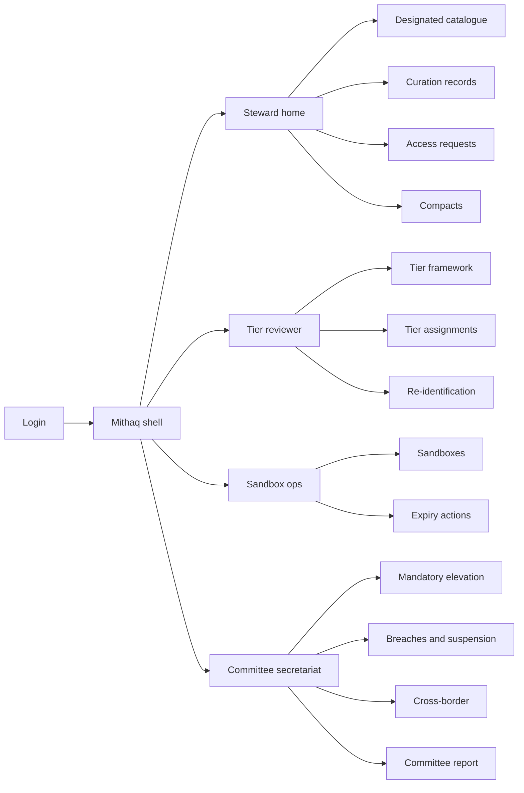
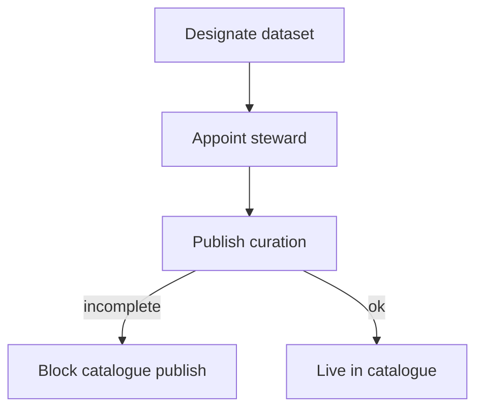
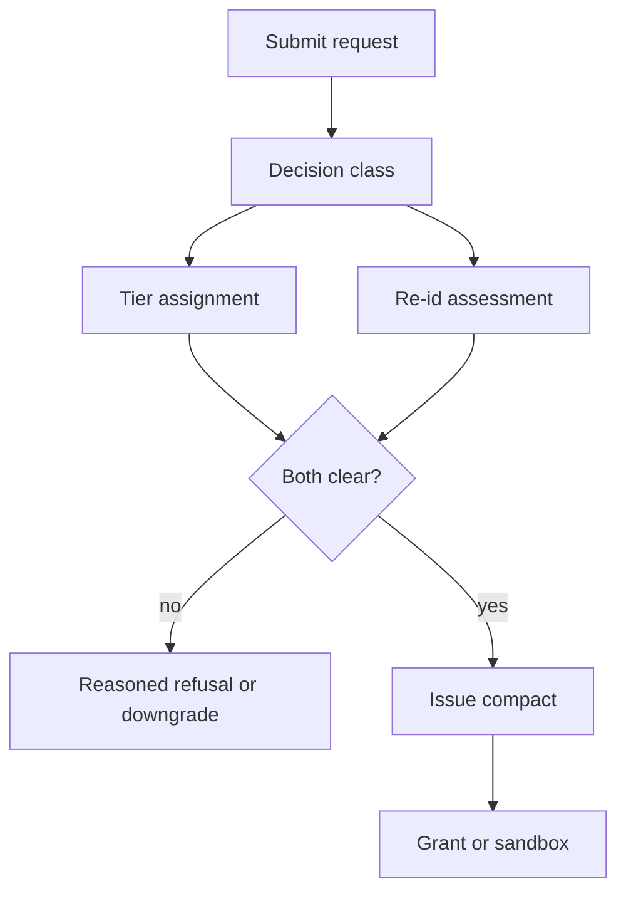

# Mithaq — Web app

**Product:** [PRODUCT.md](./PRODUCT.md)
**Primary surface:** National data-compact register console (steward, reviewer, sandbox, and committee secretariat workspaces under one Mithaq shell)
**Secondary surfaces:** Public designated-dataset catalogue (read-only terms + reciprocity schedule); committee standing report export (PDF/CSV)
**Design thesis:** Mithaq is a compact register with a gate in front of it — not an open-data portal and not a generic “AI ethics” dashboard. The metaphor is a sealed instrument and a sand timer: every release is a written obligation on the receiver, stamped with an explainability tier and either a production grant or a time-boxed sandbox that expires into deletion or re-permission. Visual language is deep indigo night (Gulf administrative gravity) with parchment-white panels, gold for reciprocity credit, and coral only for cross-entity suspension. The Mithaq wordmark reads as a quiet seal on every compact and assessment screen — the state’s instrument, not a ministry’s side project.

## UX research synthesis

### Category peers (best-in-class)

- **Findata (Finland data permit authority):** Permit application → decision class → reasoned decision within a published SLA. Steal: request-to-reasoned-decision timeline and refusal as a first-class recorded act; reject Findata’s health-only scope where Mithaq spans genome, Arabic corpora, and transport telemetry.
- **HDR UK Gateway / NHS Secure Data Environments:** Dataset discovery separate from project access; TRE/sandbox as the default for sensitive extracts. Steal: catalogue ≠ access; sandbox expiry and participant bounds; reject UK “project application essay” length for Qatar’s administratively compact steward–minister path.
- **Singapore IMDA Trusted Data Sharing / SGTraDex-style exchanges:** Reciprocity and contractual obligations as product surfaces, not legal PDFs alone. Steal: published terms schedules and contribution credit; reject commodity trade UX that treats datasets as fungible SKUs.
- **ONS Secure Research Service (UK):** Accreditation, project approval, and output checking before release. Steal: tiered duty keyed to decision harm; reject researcher-only framing for mandatory government-entity mode.

### Patterns to adopt / reject

- **Adopt:** Designation with named steward and curation record; receiver-obligation compact (not holder permission slip); mandatory vs voluntary mode on one register; priced reciprocity; reviewer-assigned explainability tier by decision class; re-identification sized to ~250k citizen population with auto-offer of aggregate/synthetic; sandbox hard expiry; cross-border compact as same instrument; standing committee report.
- **Reject:** Open-data “download now” for designated national assets; self-declared ethics checkboxes; silent unanswered requests; permanent “pilot” without expiry; national-security OSINT inside the open compact regime; purple AI morality chatbots.

### Trust, density, and workflow constraints from PRODUCT.md

The register holds terms, tiers, and assessments — never the underlying data (BR-1 boundary). Genome and clinical cohort size is a structural re-id risk (BR-10). Tier criteria must be locally versioned for Qatari norms and international guidance (BR-4, BR-5). Sandbox authorisation must clear in days for event-window pilots (BR-7). Non-cost justifications must be recorded at approval or pilots die on labour-cost comparisons (BR-11). Obligation breach suspends the receiver across every holding entity (secretariat story).

## Information architecture

### Nav model

### Roles → default home

| Role | Default home | Why |
|------|--------------|-----|
| Dataset steward | Steward home — pending requests in service period | Named owner, reasoned decisions (BR-6) |
| Research data officer | Catalogue + my requests | Discover, request, reuse curated assets (BR-8) |
| Ethics tier reviewer | Tier assignment queue | Decision-class tiers, not self-declare (BR-4, BR-5) |
| Sandbox operator | Sandbox authorisations | Days-not-quarters for event windows (BR-7, BR-11) |
| Committee secretariat | Standing report + mode elevation | Evidence for multilateral claim (BR-12, BR-2) |
| Foreign Ministry officer | Cross-border compacts | Same instrument internationally (BR-9) |

### Cross-links to OpenAPI resources

| Nav area | OpenAPI tags / resources |
|----------|---------------------------|
| Designated catalogue / stewards | Catalogue |
| Curation records | Curation |
| Access requests / classification / refusal | Requests |
| Decision classes / explainability tiers / assignments | EthicsTiers |
| Re-identification assessments | RiskAssessment |
| Compacts / mode / reciprocity | Compacts |
| Production access grants | Access |
| Sandboxes / expiry | Sandboxes |
| Obligation breaches / suspension | Obligations |
| Cross-border compacts | CrossBorder |
| Derived apps / committee report | Reporting |

## Screen inventory

### Steward home

- **Purpose:** Answer “what am I obliged to decide this service period, and under which receiver obligations?” in one composition.
- **Entry:** Post-login for stewards; alert when SLA nears.
- **Layout regions:** Brand + holding-entity switcher; SLA clock strip; pending request queue; live compact count; reciprocity schedule snapshot; breach alerts affecting counterparties.
- **Primary actions:** Open request; designate dataset; publish curation; refuse with reason.
- **Empty / loading / error:** Empty = designate first national dataset wizard; error = retry with request id.
- **BR / story ties:** BR-1, BR-6; steward stories.

### Designated dataset catalogue

- **Purpose:** Publish once: access terms, receiver obligations, steward, curation status — discoverable without granting data.
- **Entry:** Steward nav; public secondary catalogue; research officer entry.
- **Layout regions:** Dataset cards (interactive request surfaces); filters (genome, clinical, Arabic corpus, transport/event); steward and service period; reciprocity eligibility chip.
- **Primary actions:** Request access; view obligations; view curation semantics.
- **Empty / loading / error:** Empty catalogue = committee onboarding prompt; unpublished = steward-only draft.
- **BR / story ties:** BR-1, BR-6, BR-8.

### Curation record editor

- **Purpose:** Funded field-level semantics so a second application reuses meaning without renegotiation.
- **Entry:** From designation or catalogue.
- **Layout regions:** Field dictionary; comparability metadata; version history; funding/obligation status.
- **Primary actions:** Publish curation; request funding flag; clone prior version.
- **Empty / loading / error:** Incomplete curation blocks designation completion.
- **BR / story ties:** BR-8.

### Access request intake

- **Purpose:** Capture intended use, classify decision class, start gate path.
- **Entry:** Catalogue CTA; research officer home.
- **Layout regions:** Intended-use form; decision-class selector; extract specification; counterpart type (domestic/cross-border); service-period clock once submitted.
- **Primary actions:** Submit; save draft; withdraw.
- **Empty / loading / error:** Validation on missing decision class; national-security keyword route-out banner (out of scope).
- **BR / story ties:** BR-4, BR-6, BR-9.

### Explainability tier assignment

- **Purpose:** Reviewer assigns tier to decision class; highest tier blocks production until plain-language individual account exists.
- **Entry:** Reviewer queue; from request detail.
- **Layout regions:** Locally versioned tier criteria; decision-class context; assignment rationale; production precondition checklist (plain-language account for highest tier).
- **Primary actions:** Assign tier; request more info; block production use.
- **Empty / loading / error:** Empty queue = healthy; criteria edit requires secretariat role.
- **BR / story ties:** BR-4, BR-5; organ-allocation failure mode.

### Re-identification assessment

- **Purpose:** Size extract against small national population; clear, downgrade to aggregate/synthetic, or block — with auto-offer, not silent refuse.
- **Entry:** Parallel gate on request; reviewer/steward.
- **Layout regions:** Cohort size vs population model; threshold result; downgrade offer pane; assessment stamp (immutable once issued).
- **Primary actions:** Clear; offer aggregate/synthetic; block with reason.
- **Empty / loading / error:** Missing extract spec blocks assessment.
- **BR / story ties:** BR-10; research officer story.

### Compact issue and mode

- **Purpose:** Issue the two-mode instrument: receiver obligations, reciprocity, tier conditions, grant or sandbox.
- **Entry:** After both gates clear; secretariat elevation flows.
- **Layout regions:** Compact document view (append-only); obligation list; reciprocity terms; mode badge (mandatory/voluntary); linked grant/sandbox.
- **Primary actions:** Issue compact; elevate mode when policy changes; record reciprocity contribution.
- **Empty / loading / error:** Gate incomplete = cannot issue; mode elevation shows before/after entity list.
- **BR / story ties:** BR-1, BR-2, BR-3.

### Reciprocity accounting

- **Purpose:** Contributors see better published terms than pure consumers.
- **Entry:** Compact detail; steward/receiver dashboards.
- **Layout regions:** Contribution ledger; published better-terms schedule; eligibility for next request.
- **Primary actions:** Record contribution; apply schedule to draft compact.
- **Empty / loading / error:** Empty = consumer-only terms shown honestly.
- **BR / story ties:** BR-3.

### Sandbox authorisation and expiry

- **Purpose:** Days-scale authorisation with hard end date, bounded participants, non-cost justification, forced deletion or re-permission.
- **Entry:** Sandbox ops home; from compact when production not cleared.
- **Layout regions:** Authorisation form (end date, participants, non-cost justification); countdown; expiry action controls; proof-of-deletion upload.
- **Primary actions:** Authorise; extend (new version); execute expiry; re-permission.
- **Empty / loading / error:** Overdue without expiry action = coral blocking state.
- **BR / story ties:** BR-7, BR-11.

### Obligation breaches and suspension

- **Purpose:** Breach against one holder suspends receiver across all holding entities.
- **Entry:** Secretariat; steward alerts.
- **Layout regions:** Breach queue; evidence; affected compact map; suspension broadcast status.
- **Primary actions:** Adjudicate breach; suspend; reinstate with dual control.
- **Empty / loading / error:** Empty = no active suspensions.
- **BR / story ties:** Secretariat suspension story; BR-12.

### Cross-border compact register

- **Purpose:** Same instrument with counterpart jurisdiction; ratification status.
- **Entry:** Secretariat / Foreign Ministry.
- **Layout regions:** Counterpart list; reciprocal obligation mapping; ratification timeline; domestic parity checklist.
- **Primary actions:** Draft; submit for ratification; activate on register.
- **Empty / loading / error:** Empty = “no multilateral instrument yet — create first” (blueprint leadership claim).
- **BR / story ties:** BR-9, BR-12.

### Committee standing report

- **Purpose:** Shares, obligations, tiers, breaches, sandboxes, derived applications — evidence not assertion.
- **Entry:** Secretariat default secondary; scheduled export.
- **Layout regions:** KPI strip; compact activity table; derived application registry; export controls.
- **Primary actions:** Generate period report; drill to compact; brief PMO pack.
- **Empty / loading / error:** Empty period = zero shares with explanation.
- **BR / story ties:** BR-12.

## Key flows

1. **Designate and curate** — name steward → curation record → publish catalogue entry; failure: incomplete curation blocks designation.

2. **Request to compact** — intake → decision class → tier + re-id gates → compact → grant or sandbox; failure: reasoned refusal inside SLA.

3. **Sandbox expiry** — hard end → deletion proof or re-permission; failure: overdue blocking state.

4. **Mandatory elevation** — secretariat elevates guideline → government-entity compacts flip mode → auditable before/after.

5. **Breach suspension** — record breach → adjudicate → suspend receiver everywhere → notify all stewards.

## Design system

### Tokens (CSS variables)

- `--color-ink: #E8E4DC` — primary text on night ground
- `--color-night: #0C1220` — app ground
- `--color-panel: #161E2E` — panels
- `--color-parchment: #F4F0E6` — compact document surface (instrument, not page cream brand)
- `--color-indigo: #2A3F6B` — chrome
- `--color-gold: #C4A35A` — reciprocity credit
- `--color-teal: #3A8F8C` — gate cleared / grant active
- `--color-coral: #D45D4A` — suspension / overdue expiry
- `--color-steel: #8A93A3` — secondary labels
- `--color-brand: #D4C4A0` — Mithaq seal accent
- `--font-display: "Fraunces", serif` — compact titles and catalogue names
- `--font-body: "IBM Plex Sans", sans-serif` — console UI
- `--font-mono: "IBM Plex Mono", monospace` — compact ids, tier versions, assessment hashes
- `--space-1`…`--space-8`: 4px scale
- `--radius-sm: 4px`; `--radius-md: 8px`
- `--motion-seal: 180ms ease-out` — compact issued stamp
- `--motion-sand: 320ms linear` — sandbox countdown tick emphasis
- `--motion-suspend: 200ms ease-in-out` — coral suspension pulse
- Atmosphere: fine geometric mashrabiya-inspired line texture in night panels (subtle, not ornamental overload); compact view uses parchment panel with seal watermark; no stock skyline heroes in console.

### Typography & brand

- Display serif for dataset names and issued compact titles; body for workflow; mono for ids and tier version pins.
- Brand seal left of chrome on every compact, assessment, and committee report view.
- Login/marketing shell: brand as hero; one headline (“Obligations on the receiver”); one CTA — no six-pillar strategy collage.

### Do / don’t

- **Do:** Show receiver obligations before approve; publish reciprocity schedule; auto-offer aggregate/synthetic on re-id fail; force sandbox expiry action; version tier criteria locally.
- **Don’t:** Download buttons on designated assets; self-serve ethics tiers; silent request expiry; permanent pilots; purple AI glow; card grids of pillar icons as the product.

### Accessibility & domain trust cues

- Contrast AA+ for gold/coral on night and ink on parchment; suspension uses icon + text.
- Live regions for SLA breach risk, sandbox expiry, and cross-entity suspension.
- Focus order: catalogue → request → gates → compact → access/expiry.
- Append-only compact history readable by auditors without edit affordances.

## Component patterns

- **CompactInstrumentView** — parchment append-only compact with seal, mode, obligations.
- **ReceiverObligationList** — what the requester must do, shown before steward approve.
- **ReciprocityCreditChip** — contributor vs consumer terms.
- **TierAssignmentPanel** — decision class → tier with local criteria version.
- **ReidDowngradeOffer** — clear / aggregate / synthetic / block.
- **SandboxTimer** — hard end date with overdue coral state.
- **NonCostJustificationField** — required on sandbox authorise.
- **CrossEntitySuspendBanner** — receiver suspended everywhere.
- **CommitteeReportPack** — standing account export.
- **ServicePeriodClock** — request SLA countdown.

## Out of scope for v1 web

- Hosting or transferring genomic/clinical raw data inside Mithaq; national-security OSINT tooling; citizen-facing consent UX for every source system; full TRE compute IDE (integrate with holder sandboxes); multilingual public portal beyond catalogue; treaty drafting suite for MFA.
